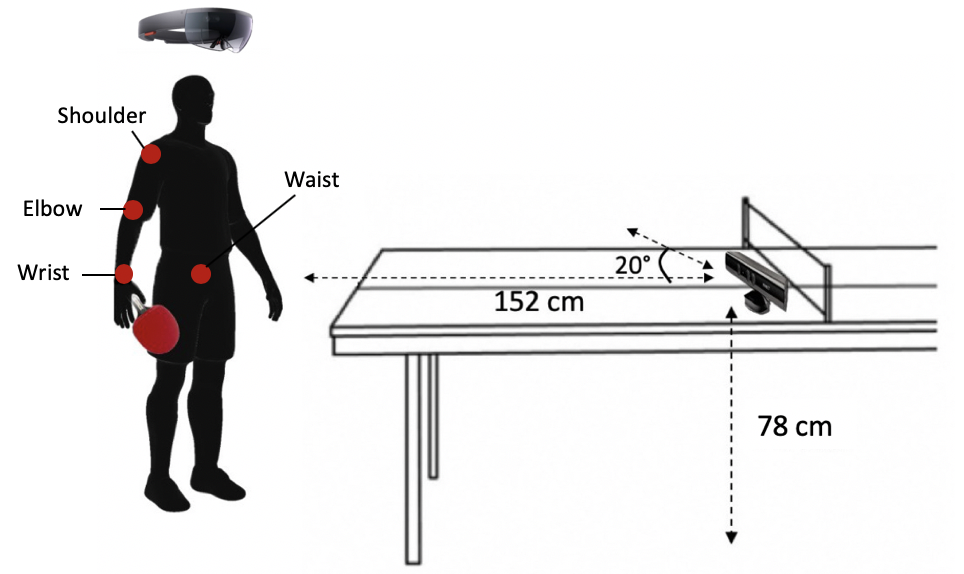
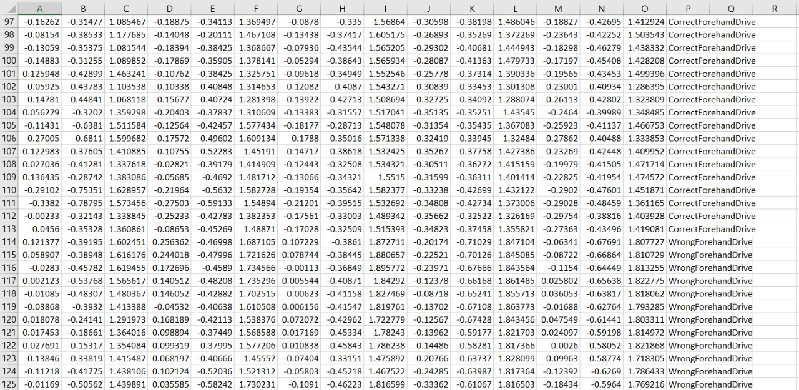

# TrainIT

TrainIT is a detection and classification system for wrong played strokes in table tennis.

## General Knowledge 
Table tennis game became one of the most popular games around the world in the past years where it reached around 16 million players in the US only. 
It consists of two main types of strokes Forehand & Backhand, and each one contains sub-strokes such as Forehand drive, Backhand drive, Backhand push, Forehand push, Forehand Top Spin and Backhand Top Spin.

TrainIT covers all of the 6 strokes mentioned above and will be explained in more detail in the usage part.

## Setup

It takes 1 minute to setup TrainIT all you have to do is to get a Kinect and a smart band, place the Kinect as it is shown in the figure below  then click on start training from the android application and you are ready to go!

## Tools
We have used Python for making the server-side and running the machine learning algorithms. C# for using the Microsoft Kinect SDK and detecting the joints of the player's body. SQL for the database. Java & Android Studio for making the android application.

## Dataset 
This is a sample of our dataset. The column represents the X,Y,Z dimension of the main joints we works on wrist, elbow, shoulder, left waist, right waist in order and the rows represents the stroke type and whether it is correctly played or not.

## Usage

TrainIT is used for detecting the strokes by the players and give them real-time feedback and reports for their performance whether it's correct or false on an android application. Also a full tracking system for the coach to track his players performance by listing all of the players' reports daily, weekly and monthly in his account, and also he can send them notifications.

## Contributing

We managed to make 4 research papers. Currently, we have 1 published, one accepted and waiting to be published, and two submitted papers.

#### Paper 1
[Paper 1](*paperlink*) Published in The 11th International Conference on Ambient Systems, Networks and Technologies in Poland. Titled as “Online detection and classification of in-corrected played strokes in table tennis using IR depth camera.”
##### Contribution
Created real-time application with the usage of the Kinect sensor.

#### Paper 2
[Paper 2](https://google.com) Published a paper in the 17th International Conference on Mobile Systems and Pervasive Computing in Belgium. Titled by “IPingPong: A Real-time Performance Analyzer System for Table Tennis Stroke’s Movements.”
##### Contribution
Added more error types, and increased the classification accuracy.

#### Paper 3

Submitted in INASS Journal. Titled by “Multi-Sensor Fusion for Online Detection and Classification of Table Tennis Strokes.”
##### Contribution
Sensor fusion and measure classification accuracy with time responding.
#### Paper 4
Submitted in JSPAN Journal. Titled by “Usability Study for a comprehensive table tennis AR-based training system with the focus on players' strokes.” 
##### Contribution
Supported the system with AR application for notification, and made a usability study.

## Project Main Website
http://miuegypt-001-site13.btempurl.com/trainit/
